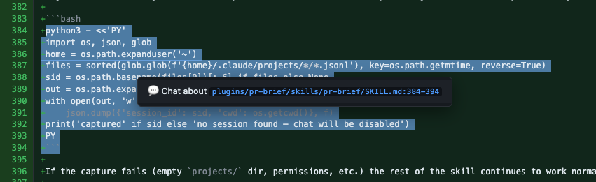
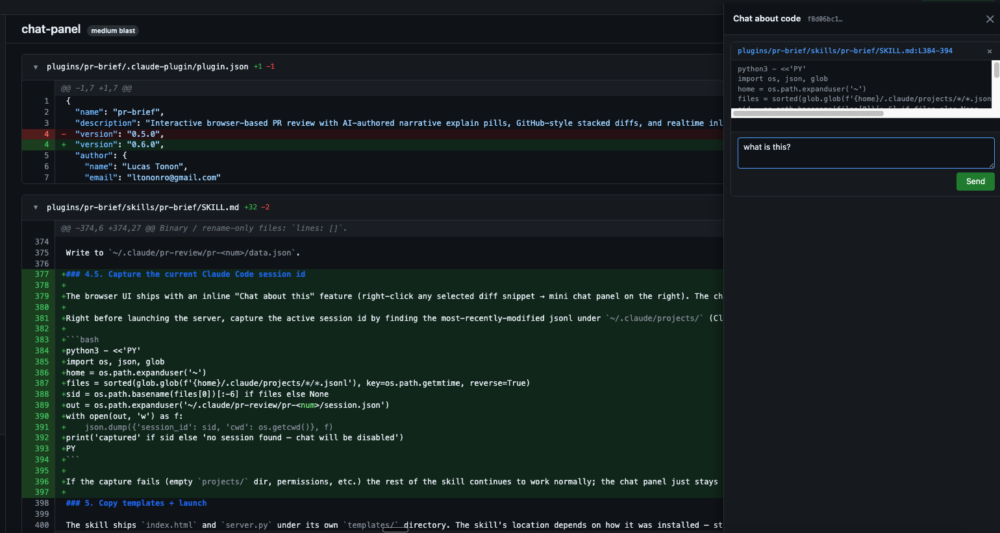

# pr-brief — Claude Code marketplace

An interactive, browser-based PR review workflow for [Claude Code](https://docs.claude.com/en/docs/claude-code/overview). It pulls a pull request via `gh`, asks an Opus agent to group every changed file into features and author a **narrative layer** of "explain pills", and launches a local UI with GitHub-style stacked diffs, click-and-drag multi-line inline commenting, and realtime comment posting.

This repository is a **plugin marketplace**. It ships one plugin: `pr-brief`.

What reviewers get:

- A reviewer-ordered file list (migrations first, tests last) grouped into the features the PR actually contains
- Two parallel narrative layers next to each diff:
  - Purple ✨ **explain pills** — short AI-authored callouts that connect each block to the broader change
  - Red ⚠ **critique pills** with a severity score S1–S5 — actual review concerns, optional `suggested_change` blocks, and a "Use as comment →" button that turns a critique into an inline GitHub comment in one click
- Click-and-drag multi-line inline comments that POST to GitHub in realtime via `gh api`
- 💬 **Inline chat:** right-click any selected snippet → a streaming chat panel pops on the right that resumes the same Claude Code session that wrote the brief, so it already has full PR context. ([details below](#inline-chat--ask-claude-about-any-snippet))
- Runs locally; the only external call is to the Anthropic API your Claude Code session is already using

---

## Demo

[](https://youtu.be/9d9u7UEAgLU)

---

## Why this exists

Three reasons:

1. I had to review ginormous PRs and I couldn't afford asking folks to break their PRs and stack them.
2. Reviewing PRs is somewhat of finding needles in a haystack — with this I can know the right sequence to look.
3. Reading code isn't always straightforward; you have to connect the dots between files mentally. This facilitates it.

---

## Install

In Claude Code:

```
/plugin marketplace add lucastononro/pr-brief
/plugin install pr-brief@pr-brief-marketplace
```

To update later:

```
/plugin marketplace update pr-brief-marketplace
```

### Prerequisites

- `gh` CLI installed and authenticated (`gh auth status`)
- `python3` on `PATH`
- A modern browser

---

## Use

Once installed, ask Claude any of:

- "review this pr"
- "brief pr 1234"
- "narrate pr https://github.com/owner/repo/pull/1234"

…or invoke the skill explicitly:

```
/pr-brief:pr-brief 1234
```

Claude will fetch the PR, build a feature plan + narrative, and open a local UI at `http://localhost:7681`. Inline comments save in realtime — each save POSTs to GitHub via `gh api`.

All artifacts live under `~/.claude/pr-review/pr-<num>/`. The target repo is never modified.

---

## Inline chat — ask Claude about any snippet

Once the UI is open, **select any code inside a diff and right-click**. A "💬 Chat about `<path>:<lines>`" item appears:



Click it and a multi-turn chat panel pops on the right, pre-loaded with the file path, line range, and the selected code. Type a question — Cmd/Ctrl+Enter sends — and tokens stream in:



<video src="docs/inlinechat-demo.mp4" controls width="100%" muted></video>

The trick: every chat panel — across snippets, across files, across page reloads — resumes the **same Claude Code session that authored the PR brief** (`claude --resume <id>`). So the chat already has the full PR in context. No re-seeding, no separate persistence layer, and cross-snippet follow-ups ("compare this with the previous file") just work.

Shortcuts:

- **Cmd/Ctrl + Enter** — send
- **Esc** — close the right-click menu
- **Stop** (mid-stream) — SIGTERMs the in-flight subprocess; partial answer stays

The chat panel only lights up when the skill captured a resumable session id (it writes `~/.claude/pr-review/pr-<num>/session.json` automatically at run time). If capture failed for any reason, the right-click menu silently doesn't appear and the rest of the UI works normally.

---

## Repo layout

```
.
├── .claude-plugin/
│   └── marketplace.json          # the marketplace catalog
└── plugins/
    └── pr-brief/                 # the plugin
        ├── .claude-plugin/
        │   └── plugin.json       # plugin manifest
        └── skills/
            └── pr-brief/
                ├── SKILL.md      # skill definition + instructions
                └── templates/
                    ├── index.html  # browser UI
                    └── server.py   # local stdlib HTTP server
```

---

## Develop locally

Test the plugin without publishing:

```bash
claude --plugin-dir ./plugins/pr-brief
```

Or test the marketplace end-to-end from a sibling directory:

```
/plugin marketplace add /absolute/path/to/pr-brief
/plugin install pr-brief@pr-brief-marketplace
```

Validate the marketplace JSON:

```bash
claude plugin validate .
```

---

## Cost & privacy

- **Cost:** the narrative layer (file grouping + explain pills) is generated by Claude Opus through your existing Claude Code session. There is no separate billing — usage counts against your Anthropic plan/key like any other Claude Code call. A typical PR (10–40 files) consumes a few thousand input tokens and a small output budget per file.
- **Privacy:** the diff is sent to the Anthropic API your Claude Code session is configured for. Nothing else leaves your machine. The local UI is served on `127.0.0.1:7681` and the comments are POSTed directly to GitHub via your authenticated `gh` CLI. There is no pr-brief server, no telemetry, no third party.

---

## License

MIT
